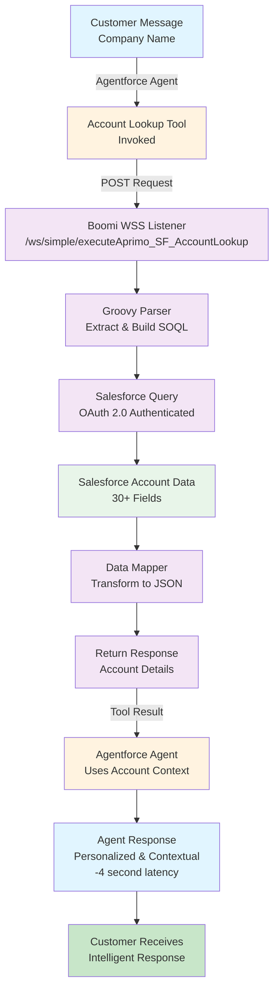

# Aprimo SF Account Lookup for Agentforce

An agentic tool that enables Agentforce agents to autonomously query Salesforce account data during conversations.

## What Agents Can Do

Agentforce agents use this tool to:

- **Look up customer accounts** by name, industry, type, or location
- **Access real-time account data** during agent conversations (revenue, employee count, rating, etc.)
- **Make informed decisions** based on account context (e.g., prioritize high-value prospects, tailor responses by industry)
- **Retrieve account details** without human intervention—agents operate autonomously

Example agent workflow:
```
Customer: "I'm from Smart Health Systems. Can you help me?"
  ↓
Agent: [Invokes Account Lookup tool]
  ↓
Agent: "Welcome! I see you're from Smart Health Systems in the Healthcare industry 
        with 500 employees. Let me help you with..."
```

## Flow Diagram



---

## Agent Tool Definition

**Tool Name:** Aprimo SF Account Lookup

**When agents should use it:**
- Customer identification (name, company, location provided)
- Retrieving account context for personalized responses
- Checking account status or industry classification
- Making informed routing or prioritization decisions based on account tier, revenue, or rating

**Response time:** 3-4 seconds

**Data returned:** Structured account data (30+ Salesforce Account fields—no images or URLs)

### What Agents Receive Back

The tool returns **pure structured data**:
- **Text fields**: Name, Industry, Type, Website, Owner Name, Description, AccountSource
- **Numeric fields**: AnnualRevenue, NumberOfEmployees, SDO_Value, Opportunity_Win_Rate
- **Status fields**: Rating (Hot/Warm/Cold), SDO_Partnership_Status, Tier, SDO_Account_Priority
- **Dates**: LastActivityDate, LastModifiedDate, CreatedDate
- **Location fields**: BillingCountry, BillingState, BillingCity
- **Custom fields**: SDO_Sales_Region, SDO_Days_Since_Activity, Number_Closed_Opportunities, etc.

### How Agents Use This Data

Once the agent receives account context from this tool, they can:
- **Personalize responses** — Reference company size, industry, rating in real-time conversation ("I see you're from a Hot-rated Healthcare prospect with 500 employees")
- **Make informed decisions** — Prioritize high-value accounts (Hot rating, high revenue) for faster response or specialist handling
- **Tailor messaging** — Adjust tone, recommendations, or offerings based on industry, type (Prospect vs. Customer), or partnership status
- **Provide context** — Reference account history, ownership, activity, or specific metrics during conversation
- **Route intelligently** — Direct accounts to specialized teams based on tier, region, or opportunity pipeline
- **Inform strategy** — Leverage win rates, closed opportunity value, or partnership status to suggest next steps

---

## The Tool Endpoint

```
POST https://aprimo-prod.boomi.cloud/ws/simple/executeAprimo_SF_AccountLookup
```

**Agent input (from conversation context):**
```json
{
  "accountName": "Smart Health Systems"
}
```

**Agent receives:**
```json
{
  "accounts": [
    {
      "id": "001Hs00005uiMzZIAU",
      "name": "Smart Health Systems",
      "industry": "Healthcare",
      "type": "Prospect",
      "billingCountry": "France",
      "annualRevenue": 50000000,
      "numberOfEmployees": 500,
      "rating": "Hot"
    }
  ]
}
```

---

## How The Integration Works

5-shape Boomi process handles the agentic call:

1. **WSS Listener** - Receives agent POST requests
2. **Groovy Parser** - Extracts account name, builds SOQL filters
3. **Salesforce Query** - OAuth-authenticated account lookup
4. **Data Mapper** - Returns account data to agent
5. **Response Handler** - Agent uses data in conversation

---

## Configuration

**Agent tool in Agentforce:**
- Endpoint: `https://aprimo-prod.boomi.cloud/ws/simple/executeAprimo_SF_AccountLookup`
- Method: POST
- Auth: Basic Auth (Salesforce-aprimo-master credential)
- Input: JSON with `accountName` field
- Output: Account record(s) with 30+ fields

**Supported filters:**
- `accountName` - Search by company name
- `industry` - Filter by industry
- `type` - Filter by account type
- `billingCountry` - Filter by country

---

## Implementation Notes

### Property Scope in Boomi
The integration uses `ExecutionUtil.setDynamicProcessProperty()` for Groovy-based document properties. This is critical—using `props.setProperty()` silently fails for the `document.dynamic.userdefined.*` scope.

### Atom Requirements
Requires Intermediate or Basic tier atom. Advanced atoms use API Service wrapper pattern instead.

---

## Files

- `/docs/FINAL_CONFIG.md` - Credentials, endpoint details
- `/docs/LESSONS_LEARNED.md` - Technical discoveries
- `/boomi/processes/Aprimo_SF_AccountLookup.xml` - Process definition
- `/agentforce/tool-definitions/` - Agent tool setup
