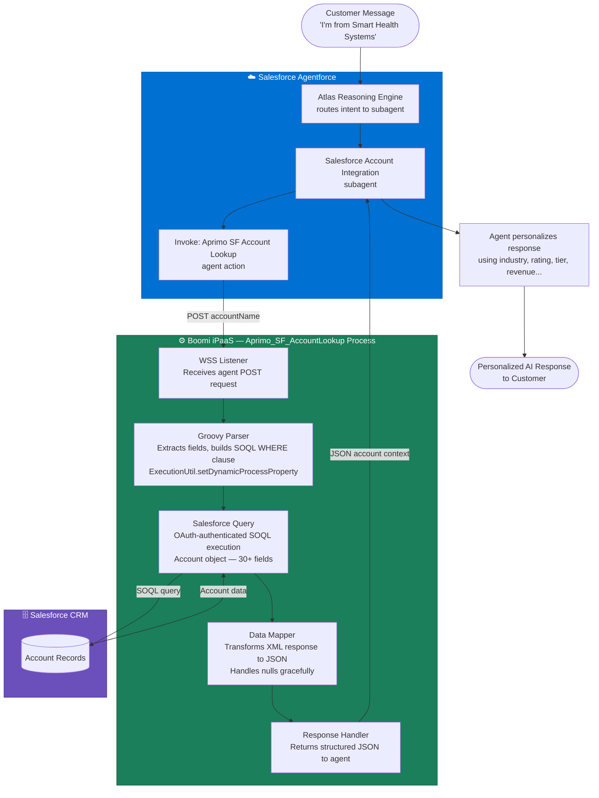
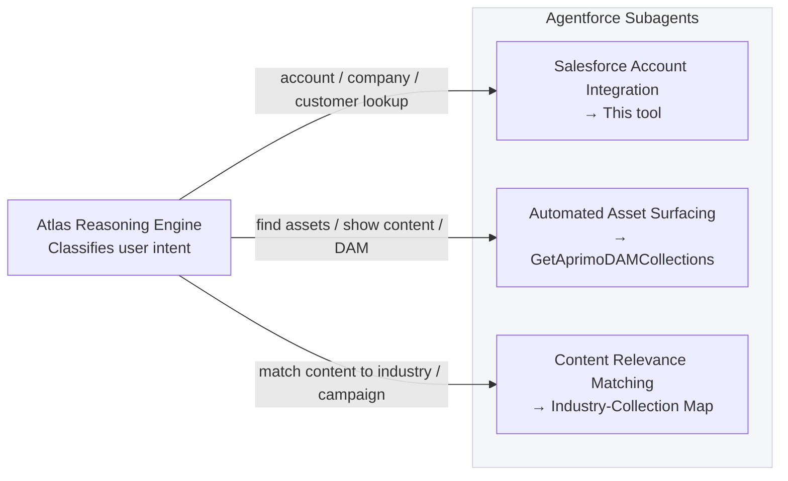

# Aprimo SF Account Lookup — Agentforce Tool

> **Built by Rob Rojas, Technical Engagement Manager & Solutions Architect at Aprimo**
> *Salesforce Agentforce · Boomi iPaaS · Salesforce CRM · Enterprise AI Integration*

---

## What This Does (Plain English)

Imagine a customer calls in and says, *"Hi, I'm from Smart Health Systems."* Normally, a support agent would need to pause the conversation, open Salesforce in a separate window, search for that company, scan the account record, and then come back to the conversation — all while the customer waits.

**This tool eliminates that pause entirely.**

When a Salesforce AI agent (Agentforce) hears a customer mention their company, it automatically looks up that account in Salesforce CRM *in the background* — in 3–4 seconds — and comes back with a full picture: the company's industry, size, revenue tier, account rating, sales region, and more. The AI agent then uses all of that context to respond intelligently, personalize the conversation, and make smart decisions — without any human having to lift a finger.

**The result:** AI agents that behave like experienced sales reps who already know the customer — not like bots reading from a script.

---

## Business Value at a Glance

| Without This Tool | With This Tool |
|---|---|
| Agent asks customer to identify themselves | Agent already knows who they are |
| Rep manually searches CRM mid-conversation | Account data loads automatically in background |
| Generic responses for all customers | Personalized by industry, tier, company size |
| Human routes calls based on account value | AI routes intelligently based on real CRM data |
| Salesforce data siloed from AI layer | Salesforce and Agentforce work as one system |

---

## Example: What This Looks Like in Action

**Customer says:**
> "Hey, I'm from Smart Health Systems. Can you walk me through your DAM features?"

**What happens behind the scenes (invisible to customer):**
1. Agentforce detects a company mention and invokes this tool
2. Tool sends the company name to the Boomi endpoint
3. Boomi authenticates with Salesforce and runs the account lookup
4. Salesforce returns the full account record
5. Boomi returns structured data to Agentforce

**What the AI agent responds:**
> "Welcome! I can see Smart Health Systems is one of our Hot-rated Healthcare prospects with around 500 employees. Let me tailor this to what matters most for healthcare organizations your size…"

The customer gets a personalized, informed response. The sales team gets a better-qualified interaction. Nobody had to do anything manually.

---

## Architecture

### End-to-End Flow



### Agentforce Subagent Architecture

This tool lives within a three-subagent system. Each subagent owns exactly one action, with mutually exclusive classification descriptions so Agentforce's Atlas reasoning engine routes without ambiguity:



---

## Boomi Process — Shape by Shape

| Shape | Type | What It Does |
|---|---|---|
| **WSS Listener** | Start | Receives POST from Agentforce; exposes the `/executeAprimo_SF_AccountLookup` endpoint |
| **Groovy Parser** | Data Process | Reads `accountName`, `industry`, `type`, `billingCountry` from JSON body; builds dynamic SOQL WHERE clause with `%` wildcard fuzzy matching; uses `ExecutionUtil.setDynamicProcessProperty()` (not `props.setProperty()` — see Gotchas) |
| **Salesforce Query** | Connector | OAuth-authenticated SOQL against the Account object; returns 30+ fields |
| **Data Mapper** | Map | Transforms Salesforce XML response into clean JSON; maps to `transform.map_Salesforce_Accounts_XML_to_JSON` and `RRojas_ResponseTransformMap` |
| **Response Handler** | Return | Sends structured JSON payload back to Agentforce agent |

---

## API Reference

### Endpoint

```
POST https://aprimo-prod.boomi.cloud/ws/simple/executeAprimo_SF_AccountLookup
```

### Authentication

Basic Auth using the `Salesforce-aprimo-master` credential configured in Boomi Shared Web Server.

> ⚠️ **Note:** This is Boomi's Shared Web Server auth — separate from the Boomi Platform API credentials. Do not confuse the two. They authenticate against entirely different surfaces.

### Request Body

```json
{
  "accountName": "Smart Health Systems",
  "industry": "Healthcare",
  "type": "Prospect",
  "billingCountry": "United States"
}
```

All fields except `accountName` are optional filters. Omit them to broaden the search.

### Supported Query Filters

| Field | SOQL Behavior |
|---|---|
| `accountName` | `LIKE '%value%'` — fuzzy name match |
| `industry` | `LIKE '%value%'` — partial industry match |
| `type` | `LIKE '%value%'` — partial type match |
| `billingCountry` | `LIKE '%value%'` — partial country match |

### Response

```json
{
  "accounts": [
    {
      "id": "001Hs00005uiMzZIAU",
      "name": "Smart Health Systems",
      "industry": "Healthcare",
      "type": "Prospect",
      "billingCountry": "France",
      "billingState": "Ile-de-France",
      "billingCity": "Paris",
      "annualRevenue": 50000000,
      "numberOfEmployees": 500,
      "rating": "Hot",
      "accountOwnerName": "Jane Rivera",
      "lastActivityDate": "2026-08-15",
      "sdoPartnershipStatus": "Active",
      "tier": "Enterprise",
      "sdoSalesRegion": "EMEA",
      "opportunityWinRate": 0.62,
      "numberClosedOpportunities": 4
    }
  ]
}
```

Full response includes 30+ fields across text, numeric, status, date, and location categories.

---

## How Agentforce Agents Use This Data

Once the agent has account context, it can:

**Personalize responses**
Reference company size, industry, and account rating in real-time ("I see you're a Hot-rated Enterprise prospect in Healthcare...")

**Route intelligently**
Direct high-value accounts (Hot rating, high revenue) to senior reps or specialized teams automatically

**Tailor messaging**
Adjust tone, recommendations, and product emphasis based on industry type and account tier

**Surface account history**
Reference last activity date, closed opportunities, win rate, and partnership status to inform next steps

**Fill data gaps**
When Salesforce records are incomplete, the integration supports enrichment branching — an AI inference step can infer missing fields (industry, country) from the company name alone before proceeding

---

## Configuration

### Boomi Process Settings

| Setting | Value |
|---|---|
| Process Name | `Aprimo_SF_AccountLookup` |
| Listener Type | Web Services Server (WSS) |
| Atom Tier | Intermediate or Basic (not Advanced — see Gotchas) |
| Auth Type | Basic Auth |
| Salesforce Connection | OAuth via Named Credential (`connector-settings_Salesforce Connection.json`) |

---

## Deployment Sequence

Every deployment must follow this exact order. Skipping any step leaves the old version active.

```
1. BUILD
   Make changes in Boomi Integration → Save

2. DEPLOY
   Deploy → Create Packaged Component
   Select Production Environment → Next: Review → Deploy

3. RESTART LISTENERS
   Manage → Atom Management → [Production Atom]
   Listeners → Restart All

4. VERIFY
   Listener list should show Aprimo_SF_AccountLookup as Active
   If missing: confirm the Start Shape is configured as a WSS Listener

5. TEST
   POST a sample payload to the endpoint
   Confirm account data returns in response body
   Check Boomi Process Reporting to verify SOQL built correctly
```

---

## Agentforce Setup

1. In **Salesforce Setup → Agent Actions**, create a new External Service action pointing to the Boomi endpoint
2. Define input variable: `accountName` (Text, required) — see `agentforce/tool-definitions/account-lookup-tool-definition.json`
3. Define output: structured JSON (the agent receives this and incorporates it into its response)
4. In **Agentforce Builder**, add the action to the `Salesforce Account Integration` subagent **only**
5. Write a classification description that makes this subagent the exclusive owner of account lookup requests
6. **Save → Commit → Activate** (all three steps — Save alone does not deploy)

> ⚠️ **Critical:** In Agentforce Builder, saving does not activate the agent. You must Commit and then Activate separately. Missing this step means the agent continues running the prior version.

---

## Gotchas & Lessons Learned

These are hard-won discoveries from the production build — none of them are in the official documentation.

### 1. ExecutionUtil vs. props for Dynamic Process Properties
**Problem:** Setting document-scoped dynamic properties using `props.setProperty()` silently fails with no error — the process reports success, but values are never set.
**Fix:** Always use `ExecutionUtil.setDynamicProcessProperty()` for the `document.dynamic.userdefined.*` scope.

### 2. The Atom Tier Requirement
**Problem:** Advanced tier atoms do not support the WSS Listener pattern used here.
**Fix:** This process must deploy to an Intermediate or Basic tier atom. Advanced atoms require the API Service wrapper pattern — a fundamentally different architecture.

### 3. SOQL Wildcard Bug (Agent API Tool vs. Direct POST)
**Problem:** When called via Boomi Agent Control Tower's API tool, `accountName` arrived as `%` (a bare wildcard) instead of the actual company name, causing the SOQL to return all accounts. When called via direct POST, it worked correctly.
**Root cause:** The Boomi Agent API tool sends parameters in a different payload structure than a direct POST. The Groovy parser was reading from the wrong JSON path.
**Fix:** Inspect the exact payload in Boomi Process Reporting → shape execution log, and update the Groovy extraction to match the Agent tool's actual body format.

### 4. Agentforce Permission Failures
**Problem:** The agent could invoke the action but received permission errors on execution.
**Root cause:** The Einstein Agent User was not a member of the `AgentforceServiceAgentUserPsg` permission set group. Admin debug context and live agent execution context are separate security surfaces — something that works when you test as an admin can silently fail when the agent runs it in production.
**Fix:** Add the Einstein Agent User to `AgentforceServiceAgentUserPsg` explicitly, and validate in live agent context, not admin context.

### 5. Agentforce Action Output Cannot Be Modified Post-Creation
**Problem:** Once an agent action's output definition is saved in Agentforce, it cannot be edited.
**Fix:** Delete and recreate the action from scratch if the output schema needs to change. Plan your output structure before creating the action.

### 6. One Action Per Subagent
**Problem:** Assigning multiple actions to a single subagent caused Agentforce's routing to break — actions intended for one subagent contaminated another.
**Fix:** Each subagent owns exactly one action. Classification descriptions must be mutually exclusive.

---

## Troubleshooting

**The endpoint returns no accounts**
Check Boomi Process Reporting. View the Groovy shape's document log to see the exact SOQL built. Confirm `accountName` was extracted correctly and not arriving as a `%` wildcard (see Gotcha #3).

**The listener isn't responding**
Confirm the process is deployed to the correct atom tier (not Advanced). Go to Manage → Atom Management → Listeners and confirm the process is Active. If not, restart all listeners and redeploy.

**Permission errors in Agentforce**
Do not test only in admin context. Run a live conversation using the actual agent persona. Check that the Einstein Agent User has `AgentforceServiceAgentUserPsg` group membership (see Gotcha #4).

**Agent isn't routing to this subagent**
Review the classification description on `Salesforce Account Integration`. It must unambiguously describe account lookup intent and not overlap in wording with the other two subagents. The Atlas reasoning engine routes based on intent matching against these descriptions.

---

## File Structure

```
/
├── README.md                                    # Main documentation with flow diagram
├── agentforce/
│   ├── README.md                               # Agentforce quick reference
│   └── tool-definitions/
│       └── account-lookup-tool-definition.json # Full tool schema for Agentforce
└── boomi/
    ├── connectors/
    │   ├── connector-action_Aprimo_SF_AccountLookup_Listener.json
    │   ├── connector-action_Aprimo_SF_AccountLookup_Operation.json
    │   └── connector-settings_Salesforce Connection.json
    ├── processes/
    │   └── process_Aprimo_SF_AccountLookup.json
    ├── profiles/
    │   ├── profile.json_Salesforce_Account_Query_Request_Profile.json
    │   └── profile.json_Salesforce_Account_Response_Profile.json
    └── maps/
        ├── transform.map_RRojas_RequestToFiltersMap.json
        ├── transform.map_RRojas_ResponseTransformMap.json
        ├── transform.map_Salesforce_QueryRequest_to_Account_Filters.json
        └── transform.map_Salesforce_Accounts_XML_to_JSON.json
```

---

## About the Builder

This integration was designed and built end-to-end by **Rob Rojas**, Technical Engagement Manager and Solutions Architect at Aprimo. The build spans Salesforce Agentforce configuration, custom Apex development (`@InvocableMethod` wrappers, Named Credentials, External Credential Principal Access), Boomi iPaaS process design, Groovy scripting, SOQL query construction, and full production deployment.

The same architecture underpins a broader three-tier agentic system connecting Agentforce → Boomi → Aprimo DAM, enabling AI agents to surface brand-approved digital assets in real time during customer conversations.

**Key skills demonstrated:**
- Salesforce Agentforce — subagent architecture, Atlas routing engine, permission model, deployment lifecycle
- Boomi iPaaS — WSS Listener, Groovy scripting, Data Mapper, Salesforce connector, process reporting
- Enterprise integration design — OAuth, Named Credentials, error handling, deployment sequencing
- AI agent tooling — tool definition, input/output schema design, agent instruction writing
- Production debugging — permission model root-causing, SOQL diagnostics, cross-platform auth distinction

---

*Questions about this integration or the broader Agentforce + Boomi + Aprimo DAM architecture?*
*Reach out via LinkedIn or robert.trirrr@gmail.com*
